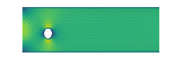
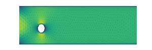

# MGN

## Description
This project provides a clean pytorch implementation of [Learning mesh-based simulation with Graph Networks](https://sites.google.com/view/meshgraphnets).

## New Features compared to original MeshGraphNets
- Using [pytorch-geometric](https://pytorch-geometric.readthedocs.io/en/latest/) data structure for graph representation and processing.
- Using [hydra](https://hydra.cc/docs/intro/) for hierarchical configuration and using [Weigts&Biases](https://docs.wandb.ai/) to track and visualize experiments.

## Visuals
<p align="center">
    
    
</p>
<p align="center">
    
    
</p>
GT: left <br />
Prediction: right

## Quantitative Results
Table below shows quantitative results of different rollout steps for both dataset cylinder_flow and flag_simple. Our results differ
from the ones published in [Paper](https://sites.google.com/view/meshgraphnets). Results can vary under different hyperparameter settings,
e.g. random seed and learning rate.

| rollout <br/> in scale(1e-3)<br> | 1    | 10    | 50    | 100   | 200   | all   |
|------------------------------|------| ---   | ---   |---    |---    |---    |
| cylinder_flow                | 3.99 | 8.90  | 18.10 | 25.36 | 34.97 | 63.56 |
| flag_simple                  | 0.98 | 12.15 | 133.51| 157.07| 157.42| 165.09|

## Installation
More simply you can install this package via packaging tool pip.


```
# download this package
git clone ...
# change directory
cd mgn
# install mgn package
pip install -e .
```

## Usage
You can train models with

```
python example/train.py model=cloth datamodule=flag_simple
```
or
```
python example/train.py model=cfd datamodule=cylinder_flow
```
For evaluating checkpoints see [eval.ipynb](./example/eval.ipynb).
